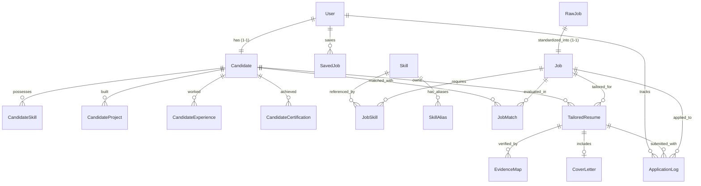

# Architecture Specification

## 1. High-Level Overview

```mermaid
graph TD
    subgraph Presentation ["Presentation Layer"]
        WEB["Web Application<br/>Simple Blue Theme"]
        DISCORD["Discord Bot (Adapter)<br/>Deprecated Commands & Notifications"]
    end

    subgraph API ["API & Domain Boundary"]
        REST["FastAPI REST API (/api/v1)"]
        AUTH["Auth & Identity Layer (User 1–1 Candidate)"]
        CONTRACTS["API Contracts & DTOs (Pydantic)"]
    end

    subgraph DomainCore ["Domain & Application Core"]
        CANDIDATE_SVC["Candidate Profile Service"]
        MATCH_SVC["Job Intelligence & Matching Engine"]
        RESUME_SVC["Resume Intelligence & Tailoring"]
        APP_SVC["Application Lifecycle Service"]
        INGEST_PIPE["Ingestion & Normalization Pipeline"]
    end

    subgraph NotificationLayer ["Notification Abstraction Layer"]
        NOTIF_SVC["Notification Service"]
        DISCORD_PROV["Discord Notification Provider"]
        EMAIL_PROV["Email Provider (Future)"]
    end

    subgraph Storage ["Persistence Layer (Source of Truth)"]
        DB[("PostgreSQL 16 + pgvector<br/>(Single Source of Truth)")]
        REDIS[("Redis (Queue / Cache)")]
    end

    subgraph Pipeline ["Autonomous Background Workers"]
        WORKER["Worker Process / Daily Batch Runner"]
        SCHEDULER["Scheduler"]
    end

    WEB -->|HTTPS / REST| REST
    DISCORD -->|HTTP / REST (Adapter)| REST

    REST --> AUTH
    REST --> CONTRACTS
    CONTRACTS --> CANDIDATE_SVC
    CONTRACTS --> MATCH_SVC
    CONTRACTS --> RESUME_SVC
    CONTRACTS --> APP_SVC

    SCHEDULER --> WORKER
    WORKER --> INGEST_PIPE
    WORKER --> MATCH_SVC

    CANDIDATE_SVC --> DB
    MATCH_SVC --> DB
    RESUME_SVC --> DB
    APP_SVC --> DB
    INGEST_PIPE --> DB

    WORKER --> NOTIF_SVC
    APP_SVC --> NOTIF_SVC
    NOTIF_SVC --> DISCORD_PROV
    NOTIF_SVC --> EMAIL_PROV
    DISCORD_PROV -.->|Webhooks / DMs| DISCORD
```

---

## 2. Core Architectural Principles

1. **Web Application is the Primary Interface**: All product interactions (Dashboard, Job Search, Match Details, Profile Management, Resume Tailoring, Application Tracking) are served through the Web Application.
2. **Business Logic MUST NOT Depend on Discord**: Discord is decoupled into an optional notification adapter. No domain rules, matching algorithms, or application state reside in the Discord bot.
3. **PostgreSQL is the Single Source of Truth at Runtime**: All runtime state (User, Candidate Profile, Jobs, Matches, Resumes, Applications) is persisted in PostgreSQL. File templates in `context/` serve solely as initial baseline seed and import/export targets.
4. **User 1–1 CandidateProfile Identity**: Every user account maps directly to one candidate profile, ensuring clean domain modeling without premature multi-tenant complexity.
5. **Strict API Contracts & Domain Boundaries**: Domain services are encapsulated behind explicit DTO interfaces (`backend/app/schemas/`), decoupled from presentation frameworks.
6. **Pluggable Notification Abstraction**: Background workers and domain services emit events to `NotificationService`, which delegates delivery to configured providers (Discord, Email).

---

## 3. Services and Responsibilities

### 3.1 Web Application (`frontend/`)
- **Role**: Primary user interface.
- **Characteristics**: Clean, professional, responsive, information-dense, Simple Blue design system (`--primary: #2563eb`).
- **Core Views**:
  - `/login` & `/register`: Authentication.
  - `/dashboard`: Daily digest summary ("What is worth applying today?").
  - `/jobs` & `/jobs/:id`: Multi-criteria search, JD inspection, match breakdowns, action buttons (*Apply*, *Save*, *Tailor Resume*).
  - `/recommendations`: High-scoring job recommendations.
  - `/profile`: Direct candidate profile editing and baseline context synchronization.
  - `/resume`: Tailored resume workspace, LaTeX/Cover Letter preview, PDF compilation download, Zero-Hallucination provenance verification.
  - `/applications`: Application lifecycle tracking from `SAVED` to `INTERVIEW`/`OFFER`.

### 3.2 Backend API & Domain Core (`backend/`)
- **Role**: Application behavior, API contracts, domain logic, and AI orchestration.
- **Layers**:
  - `api/v1/`: HTTP route handlers (`/auth`, `/profile`, `/jobs`, `/matches`, `/resumes`, `/applications`).
  - `schemas/`: Pydantic DTOs and API contracts.
  - `models/`: SQLAlchemy ORM database models.
  - `services/`:
    - `candidate.py`: Candidate profile management and context sync.
    - `matching/`: Tri-state hard filters, 7-signal deterministic scoring engine, explainable evidence generator.
    - `tailoring/` (Evidence-Grounded Resume Tailoring Engine):
      - `alias_registry.py`: Canonical technology alias registry with token boundary matching.
      - `fact_graph.py`: Fact graph and EvidenceRegistry extracting atomic facts with canonical tools and metrics.
      - `jd_capability_analyzer.py`: JD capability extraction and candidate gap analysis.
      - `resume_intelligence.py`: Strategic positioning, MMR project selection, and layout budgeting.
      - `gemini_resume_writer.py`: Semantic resume writer calling Google Gemini REST API (`gemini-3.6-flash`) with structured JSON claims output.
      - `deterministic_composer.py`: 100% offline deterministic composer fallback.
      - `evidence_validator.py`: `ClaimLevelValidator` (6-stage claim checking) & `UnitRegenerationOrchestrator` (locked-unit selective regeneration).
      - `provenance_verifier.py`: Quantitative claim-level provenance verification.
      - `latex_generator.py`: Pure LaTeX generator rendering directly from `StructuredResumeDraft`.
      - `latex_compiler.py`: PDF compilation via `pdflatex`.
      - `cover_letter_generator.py`: Contextualized cover letter composer.
    - `ingestion_pipeline.py` & `deduplication/`: Multi-source collection, SHA-256 hash caching, 3-tier deduplication.
    - `notifications/`: `NotificationService` and notification provider abstractions.

### 3.3 Background Workers (`backend/app/worker.py` & `daily_runner.py`)
- **Role**: Autonomous job scanning, taxonomy sync, batch scoring, and daily notification dispatch.
- **Modes**:
  - `--daily-batch`: Executes full daily scan (Sync context -> Ingest jobs with 0 LLM cost -> Batch match -> Rank top jobs -> Emit notification summary).
  - `--run-once`: Single collection cycle.
  - Daemon mode: Periodic collection loop.

### 3.4 Discord Notification Adapter (`discord-bot/`)
- **Role**: Supplementary notification receiver and legacy command adapter.
- **Behavior**:
  - Receives alerts (High match alerts, Daily digest) with summary cards and direct web links (`http://localhost:3000/jobs/{id}`).
  - Deprecated slash commands return brief summaries pointing users to the Web Application.

---

## 4. Entity Data Model



### Entity Summary
- **User**: Authentication and user identity (`id`, `email`, `hashed_password`, `full_name`, `is_active`).
- **Candidate**: Source of Truth candidate profile (`user_id`, `headline`, `summary`, `education`, `target_roles`, `target_locations`, `preferences`).
- **CandidateSkill / Project / Experience**: Atomic candidate facts, verifiable metrics, and claims.
- **RawJob**: Immutable source of truth from scrapers (`source`, `source_url`, `content_hash`, `raw_payload`).
- **Job**: Standardized job posting (`title`, `company_name`, `location`, `work_mode`, `level`, `min_salary`, `max_salary`, `embedding`, `status`).
- **SavedJob**: User bookmarks (`user_id`, `job_id`, `notes`).
- **JobMatch**: Deterministic match results, 7 signals, hard filter results, recommendations (`candidate_id`, `job_id`, `score`, `eligibility`, `recommendation`, `signals`, `matched_skills`).
- **TailoredResume**: Evidence-grounded LaTeX resume (`latex_source`, `pdf_path`, `provenance_score`, `is_provenance_verified`).
- **EvidenceMap**: Fact-checking links from each generated bullet point to source candidate facts.
- **ApplicationLog**: Application status state machine (`DRAFT`, `READY`, `SENT`, `INTERVIEW`, `OFFER`, `REJECTED`).

---

## 5. Dependency Rules

```text
Allowed:
  Web Frontend → Backend REST API (HTTP)
  Discord Bot → Backend REST API (HTTP)
  Backend REST API → Domain Services → Repositories → PostgreSQL
  Workers → Domain Services → Repositories → PostgreSQL
  Domain Services → NotificationService → DiscordNotificationProvider
  Domain Services → AI Services (OpenAI SDK / Local Embeddings)

Forbidden:
  Frontend → Database Direct (Must use REST API)
  Discord Bot → Database Direct (Must use REST API)
  Domain Core → Discord Bot Direct (Must use NotificationService abstraction)
  Job Pipeline → Frontend (Must be completely decoupled from UI)
```

---

## 6. Technology Stack

| Component | Technology | Role |
| :--- | :--- | :--- |
| **Web Frontend** | HTML5 / JavaScript / CSS (Simple Blue Design Tokens) | Primary Product Interface |
| **Backend API** | Python 3.11+, FastAPI, Pydantic 2.0 | API Contracts & AI Orchestration |
| **Database** | PostgreSQL 16 + pgvector | Single Source of Truth & Vector Search |
| **ORM & Migrations** | Async SQLAlchemy 2.0 (`asyncpg`), Alembic | Data Persistence |
| **Background Processing**| Asyncio Worker, Redis | Batch Ingestion & Scheduled Jobs |
| **Notification Channel**| Discord Webhook / Bot API (discord.js v14) | Notification Adapter |
| **PDF Compilation** | `pdflatex` / `xelatex` (TeXLive Sandbox) | Resume Generation |
