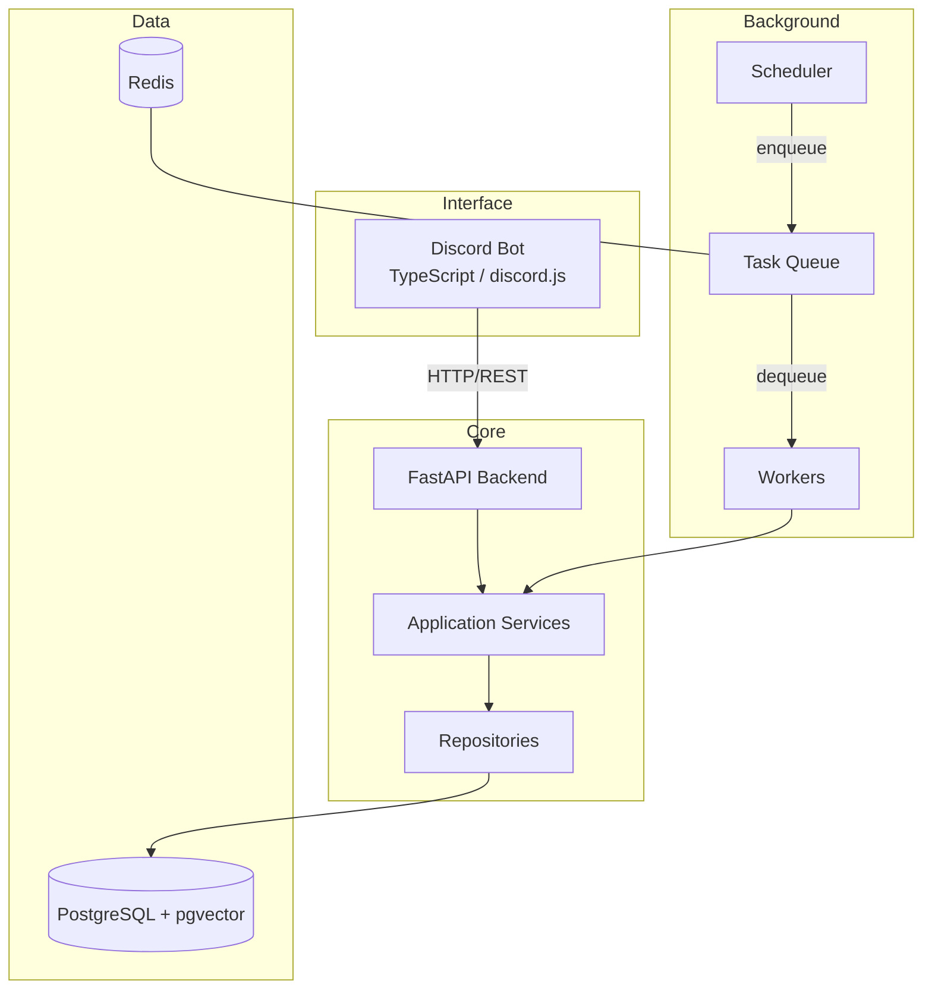
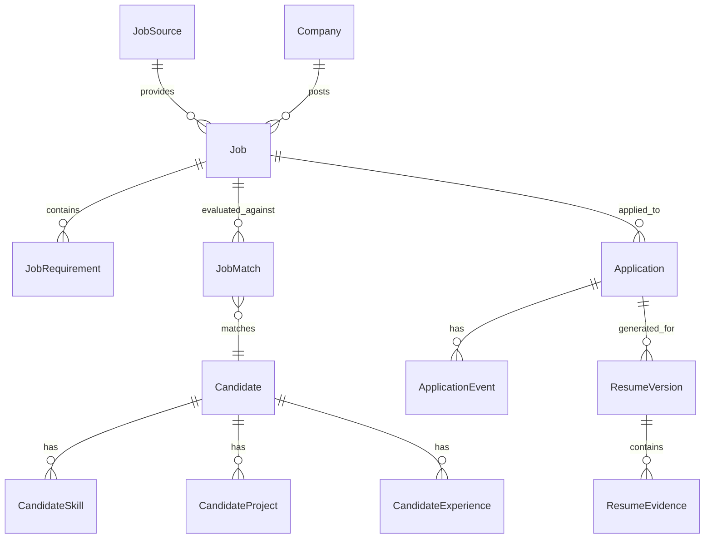

# Architecture

> **Implementation Status:** NOT IMPLEMENTED — directory structure only.
> This document describes the planned architecture.

---

## High-Level Overview



---

## Services and Responsibilities

### Discord Bot (`discord-bot/`)

**Responsibility:** Interface layer only.

- Slash commands, buttons, modals, embeds, ephemeral responses
- Notifications and daily digest delivery (DM)
- Calls backend API for all operations

**Does NOT contain:** business logic, direct DB access, direct LLM calls.

**Synchronous:** Responds to user interactions. Defers long-running work to backend/workers.

### Backend (`backend/`)

**Responsibility:** API, business logic, AI orchestration.

- REST API (FastAPI) — receives requests from Discord bot
- Service layer — matching, scoring, resume orchestration, application state
- Repository layer — all database access
- AI orchestration — calls LLM APIs, processes structured output

**Owns:** business logic, database access, AI orchestration.

**Synchronous:** API request/response. Enqueues async work to Redis.

### Workers (`workers/`)

**Responsibility:** Asynchronous and scheduled processing.

- Job collection from sources (collectors)
- AI processing jobs (JD extraction, matching, resume generation)
- Scheduled tasks (daily digest, periodic collection)
- Retry handling with backoff

**Asynchronous:** Pulls tasks from Redis queue. Calls service layer for business logic.

### Database (`database/`)

Schema definitions and migrations. Accessed only through repository layer.

---

## Communication Patterns

| From | To | Method |
|------|----|--------|
| Discord Bot → Backend | HTTP REST API | Synchronous |
| Backend → Workers | Redis queue (enqueue task) | Asynchronous |
| Workers → Backend services | Direct Python import (shared service layer) | Synchronous within worker |
| Backend → Discord | Webhook / bot API for notifications | Asynchronous |
| Workers → Discord | Via notification service → Discord API | Asynchronous |

### How Discord communicates with backend

Discord bot makes HTTP requests to FastAPI endpoints. Bot never imports backend code directly.

### How workers communicate with services

Workers import and call the same Python service layer as the backend. They share the same codebase but run in separate processes.

### How asynchronous jobs are executed

1. Backend or scheduler enqueues a task to Redis
2. Worker process dequeues and executes
3. Worker calls service layer for business logic
4. Results stored in database
5. Notifications triggered if needed

### How retries are handled

- **Safe to retry:** Job collection, JD extraction, matching, resume generation
- **Retry with backoff:** LLM API calls, external source requests
- **NOT safe to retry blindly:** Application submission (risk of duplicates)
- Failed tasks are recorded with error details
- Retry count is bounded; exhausted retries mark the task as failed

### How failures are represented

```
Task states: PENDING → RUNNING → SUCCESS | FAILED | RETRY
```

Failed tasks store: error type, error message, attempt count, last attempt timestamp.

### How notifications are triggered

Services emit notification events. A notification service formats and delivers via Discord API (DM or channel message). Workers can trigger notifications after completing background tasks.

---

## Dependency Rules

```
Allowed:
  Discord Bot → Backend API (HTTP)
  Backend API → Service Layer → Repository → PostgreSQL
  Workers → Service Layer → Repository → PostgreSQL
  Service Layer → LLM API (via AI service)
  Notification Service → Discord API

Forbidden:
  Discord Bot → Database (no direct SQL)
  Discord Bot → LLM API (no direct AI calls)
  Worker → Discord API (must go through notification service)
  API Route Handler → Database (must go through service/repository)
```

---

## Conceptual Data Model

### Entity Overview



### Entity Definitions

#### Candidate

- **Purpose:** The single user of the system.
- **Identity:** Single record (MVP is single-tenant).
- **Important fields:** name, location, target_roles, target_locations, preferences.
- **Relationships:** Has skills, projects, experience. Matched against jobs.
- **Source of truth:** `context/candidate-profile.yaml` + `context/master-resume.md` at load time; database at runtime.

#### CandidateSkill

- **Purpose:** A skill the candidate possesses.
- **Important fields:** name, category, proficiency_level (optional).
- **Relationship:** Belongs to Candidate. Referenced during matching.

#### CandidateProject

- **Purpose:** A project the candidate has built or contributed to.
- **Important fields:** name, description, technologies, role, evidence (list of verifiable claims).
- **Relationship:** Belongs to Candidate. Referenced during resume tailoring.

#### CandidateExperience

- **Purpose:** Work experience entry.
- **Important fields:** company, role, period, description, achievements.
- **Relationship:** Belongs to Candidate. Referenced during matching and resume generation.

#### JobSource

- **Purpose:** A job listing platform or feed.
- **Important fields:** name, source_type (api/feed/career_page), base_url, enabled, last_collected_at, health_status.
- **Relationship:** Provides Jobs. Owns source-specific collection logic.
- **Lifecycle:** Active / Disabled / Error.

#### Company

- **Purpose:** An employer posting jobs.
- **Important fields:** name, normalized_name, website, industry.
- **Relationship:** Posts Jobs. May appear across multiple sources.

#### Job

- **Purpose:** A normalized job posting.
- **Identity:** Internal ID. Deduplicated across sources.
- **Important fields:** See "Normalized Job Schema" below.
- **Relationships:** Belongs to Company, provided by JobSource, has Requirements, has Matches, has Applications.
- **Lifecycle:** ACTIVE / EXPIRED / DUPLICATE / REMOVED.

#### JobRequirement

- **Purpose:** A structured requirement extracted from the JD by AI.
- **Important fields:** type (required_skill / preferred_skill / education / experience / certification / other), description, category, is_hard_filter.
- **Relationship:** Belongs to Job. Used for matching.

#### JobMatch

- **Purpose:** The result of matching a Job against the Candidate.
- **Important fields:** score, recommendation, matched_requirements, missing_requirements, evidence_used, warnings, explanation.
- **Relationship:** Links Job to Candidate. One per Job per scoring run.
- **Lifecycle:** Created after analysis. May be recalculated if candidate profile changes.

#### Application

- **Purpose:** Tracks an application to a specific job.
- **Identity:** One Application per Job (for the single candidate).
- **Important fields:** status, applied_at, notes.
- **Relationships:** Belongs to Job. Has Events. Has ResumeVersions.
- **Lifecycle:** See application lifecycle in `docs/PROJECT.md`.

#### ApplicationEvent

- **Purpose:** An immutable log entry recording a state change or action.
- **Important fields:** event_type, old_status, new_status, timestamp, triggered_by (user/system), notes.
- **Relationship:** Belongs to Application. Append-only.

#### ResumeVersion

- **Purpose:** A tailored resume generated for a specific job.
- **Important fields:** version, content, format (md/docx/pdf), created_at, job_id.
- **Relationship:** Belongs to Application/Job. Contains ResumeEvidence.

#### ResumeEvidence

- **Purpose:** Links a claim in the generated resume to its source evidence.
- **Important fields:** claim, source_type (profile/resume/user_input), source_reference, section.
- **Relationship:** Belongs to ResumeVersion. Enables provenance tracing.

#### Notification

- **Purpose:** A message sent to the user via Discord.
- **Important fields:** type (daily_digest / status_update / error / high_match), content, sent_at, delivered.
- **Lifecycle:** PENDING → SENT → DELIVERED / FAILED.

---

## Normalized Job Schema

A job collected from any source is normalized to a common representation.

### Data Layers

| Layer | Description | Authority |
|-------|-------------|-----------|
| **Source data** | Raw data as received from the job source | Source platform |
| **Normalized data** | Cleaned, standardized fields | System (deterministic) |
| **AI-extracted data** | Requirements, skills, seniority parsed by LLM | AI (validated) |

### Conceptual Fields

```
source                → JobSource reference
external_id           → ID from the source platform
canonical_url         → Deduplicated URL to the job posting
company               → Normalized company name
title                 → Job title
description_raw       → Original JD text (preserved)
description_clean     → Cleaned/normalized text
location              → Structured: city, state, country, remote_policy
employment_type       → full_time / part_time / contract / internship
experience_level      → entry / mid / senior / lead / principal
salary_min            → Numeric (normalized currency)
salary_max            → Numeric
salary_currency       → ISO currency code
skills_listed         → Skills explicitly listed in posting
requirements_extracted → AI-extracted structured requirements
posted_at             → When the job was posted (from source)
discovered_at         → When the system first found it
expires_at            → Expiration date if available
```

**`description_raw` is always preserved.** Normalized and extracted data supplements but never replaces the original.

---

## Job Source / Collector Architecture

### Conceptual Interface

```
JobCollector (abstract)
├── source_name: str
├── source_type: api | feed | career_page
├── collect_jobs() → list[RawJob]        # Fetch listings
├── collect_job_details(id) → RawJob     # Fetch single job detail
├── normalize(raw: RawJob) → Job         # Transform to common schema
└── health_check() → SourceHealth        # Check source availability
```

### Adding a New Source

1. Implement the `JobCollector` interface for the new source
2. Register the collector in configuration
3. Source-specific parsing/normalization stays inside the collector
4. Common schema goes into the shared Job model

### Source-Specific Logic Isolation

Each collector owns its own:
- Authentication (if needed)
- Pagination
- Rate limiting (per-source)
- Response parsing
- Error handling

Shared across collectors:
- Normalized Job schema
- Deduplication logic
- Storage (repository layer)

### Source Failure Handling

```
Source unavailable → retry with backoff → record failure → continue other sources
Rate limited      → respect retry-after → slow down collection
Auth expired      → log error → disable source → alert user
```

Source health tracked per-source: last_success, last_failure, consecutive_failures, status.

### Source Priority

1. Official APIs (most reliable, permitted)
2. Public RSS/Atom feeds
3. Public company career pages
4. Other explicitly permitted methods

Never bypass access restrictions, CAPTCHA, or anti-bot mechanisms.

---

## Job Deduplication Strategy

### Detection Layers (in order)

| Priority | Method | Type |
|----------|--------|------|
| 1 | `source + external_id` | Exact (same source re-crawl) |
| 2 | Canonical URL normalization | Exact (same job, different URL params) |
| 3 | `company + normalized_title + location` | Probable (same job, multiple sources) |
| 4 | High text similarity on description | Fuzzy (last resort, MVP may defer) |

### Handling

- **Exact duplicate:** Merge metadata, keep earliest `discovered_at`.
- **Probable duplicate:** Link as related, present once, note multiple sources.
- **Same position from multiple sources:** Pick canonical source, track all source references.

MVP should prefer deterministic rules (layers 1–3). Fuzzy matching is a future enhancement.

---

## Discord Command Surface

> **Status:** All PLANNED — none implemented.

### Conceptual Commands

| Command | Purpose | Interaction |
|---------|---------|-------------|
| `/jobs` | List recommended jobs | Embed list + buttons |
| `/job <id>` | View job details + match | Embed + action buttons |
| `/match <id>` | View match explanation | Embed |
| `/resume <job_id>` | Generate/view tailored resume | Embed + file attachment |
| `/apply <job_id>` | Start application preparation | Modal / multi-step |
| `/applications` | List tracked applications | Embed list |
| `/application <id>` | View application details | Embed + status buttons |
| `/profile` | View candidate profile | Embed |
| `/profile update` | Update profile fields | Modal |
| `/digest` | Trigger manual daily digest | Embed |
| `/settings` | Bot settings | Embed + buttons |

### Interaction Patterns

| Pattern | Use For |
|---------|---------|
| Slash Command | All user-initiated actions |
| Embed | Displaying structured data (jobs, matches, applications) |
| Button | Quick actions (save, generate resume, approve) |
| Modal | Multi-field input (profile update, application answers) |
| Ephemeral response | Confirmations, errors, sensitive data |
| DM notification | Daily digest, status updates, alerts |

### Which Actions Use Which Interaction

- **View actions** → Embed (public or ephemeral)
- **Quick decisions** → Buttons on embeds (save job, request resume)
- **Data entry** → Modal (edit profile, answer questions)
- **Confirmations** → Ephemeral response with confirm button
- **Notifications** → DM to candidate
- **Submission approval** → DM with explicit confirm/cancel buttons

---

## Notification System

### Types

| Type | Trigger | Frequency | Channel |
|------|---------|-----------|---------|
| Daily Digest | Scheduled (cron) | Once daily | DM |
| Application Status | Status change | On event | DM |
| Error Alert | Collection/processing failure | On occurrence | DM |
| High-Match Alert | Score above high threshold | On event (future) | DM |

**MVP primary notification:** Daily digest.

Daily digest contains:
- New jobs discovered since last digest
- Top recommended matches
- Application status changes
- Collection summary (sources checked, jobs found)

High-frequency unsolicited notifications are NOT part of MVP.

---

## Scheduling and Workers

### Conceptual Architecture

```
Scheduler (cron-based)
  ↓
Redis Queue (task queue)
  ↓
Worker Process (pulls tasks)
  ↓
Task Execution (calls service layer)
```

### Worker framework

TBD — choose during implementation (candidates: Celery, ARQ, RQ, custom).

### Conceptual Tasks

| Task | Schedule | Idempotent | Retryable |
|------|----------|------------|-----------|
| `collect_jobs` | Periodic (e.g., every 4h) | Yes | Yes |
| `analyze_job` | On new job discovered | Yes | Yes |
| `match_job` | After analysis complete | Yes | Yes |
| `generate_resume` | On user request | Yes | Yes |
| `send_daily_digest` | Daily (cron) | Yes (at-most-once) | Yes |
| `submit_application` | On user approval | **No** | **No** — notify user on failure |

### Task Properties

- **Idempotent:** Re-running produces the same result (safe to retry).
- **Retryable:** Automatic retry on transient failure with exponential backoff.
- **Bounded:** Maximum retry count per task. Exhausted retries → mark FAILED → alert.
- **Observable:** Task start, completion, and failure are logged.
- **Rate-limited:** External API calls respect per-source rate limits.

---

## Error Handling

### By Category

| Scenario | Behavior |
|----------|----------|
| Job source unavailable | Retry with backoff → record failure → continue other sources |
| LLM API timeout | Retry (up to 3x) → mark AI processing as failed |
| LLM returns invalid output | Retry with stricter prompt → fail if schema invalid after retries |
| Resume generation failure | Do not create invalid resume → notify user |
| Application submission failure | **Never silently retry** → require user review |
| Database connection lost | Retry connection → fail task → alert |
| Discord API failure | Queue notification for retry → log error |

### Safe vs Dangerous Retry

| Safe to retry | Dangerous to retry |
|---------------|-------------------|
| Job collection | Application submission |
| JD extraction | Any action with external side effects |
| Matching | Payment (if ever applicable) |
| Resume generation | |
| Notifications | |

---

## Observability

### What should be observable

| Category | Metrics/Logs |
|----------|-------------|
| Job collection | Jobs found per source, duplicates detected, source errors |
| AI processing | LLM requests count, latency, failures, token usage |
| Matching | Jobs analyzed, match distribution, processing time |
| Resume generation | Resumes generated, failures, generation time |
| Applications | Status transitions, submission attempts |
| Notifications | Digest sent, delivery failures |
| Workers | Task queue depth, execution time, retry count |

**Do not log:** secrets, API keys, full candidate PII unnecessarily.

---

## Technology Stack

| Component | Technology | Status |
|-----------|-----------|--------|
| Discord Bot | TypeScript, Node.js, discord.js | PLANNED |
| Backend API | Python, FastAPI, Pydantic | PLANNED |
| ORM | SQLAlchemy | PLANNED |
| Database | PostgreSQL + pgvector | PLANNED |
| Queue | Redis | PLANNED |
| AI/LLM | OpenAI API, structured outputs | PLANNED |
| Browser automation | Playwright (where permitted) | PLANNED |
| Infrastructure | Docker Compose | PLANNED |
| Worker framework | TBD | TBD |
