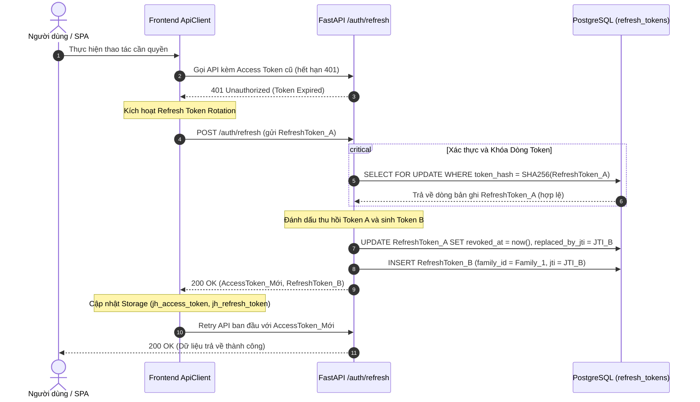
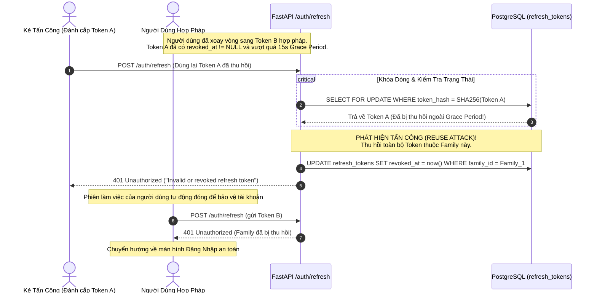

# Kiến Trúc Xác Thực & Cơ Chế Quản Lý JWT (Authentication & JWT Architecture)

---

## 1. Tổng Quan & Triết Lý Bảo Mật (Overview & Security Philosophy)

Hệ thống **JobHunter Platform** áp dụng mô hình xác thực hiện đại chuẩn **Enterprise SaaS Dual-Token Architecture** (Access Token ngắn hạn + Refresh Token dài hạn kèm Rotation & Token Family Revocation), kết hợp thuật toán băm mật khẩu **Argon2id** chuẩn OWASP 2024.

Mục tiêu cốt lõi của kiến trúc:
1. **Zero-Trust Multi-User Isolation**: Mỗi người dùng (`User`) sở hữu một không gian dữ liệu độc lập gắn liền với `CandidateProfile`, bảo vệ chống truy cập chéo (Anti-IDOR).
2. **Stateless Scalability**: Access Token phi trạng thái (Stateless) cho phép các API microservices/endpoints kiểm tra tính hợp lệ tức thì mà không cần truy vấn cơ sở dữ liệu.
3. **Session Revocability & Token Theft Neutralization**: Refresh Token có trạng thái (Stateful), được băm SHA-256 lưu trong PostgreSQL, áp dụng cơ chế **Refresh Token Rotation (RTR)** và **Token Family Revocation (TFR)** để phát hiện và vô hiệu hóa ngay lập tức các cuộc tấn công đánh cắp token (Token Theft / Replay Attack).
4. **Defense-in-Depth Concurrency Safety**: Đảm bảo an toàn tuyệt đối khi xảy ra tranh chấp phiên đăng nhập (Race Conditions) trên Single Page Application (SPA) qua 3 chốt chặn đồng bộ (Frontend Mutex, Backend Row-Locking, Grace-Period Idempotency).

---

## 2. Thông Số Kỹ Thuật Token (Token Specifications & Claims)

### 2.1. Phân Loại Token

| Tiêu chí | Access Token | Refresh Token |
| :--- | :--- | :--- |
| **Mục đích** | Xác thực mọi API calls của người dùng | Cấp mới Access Token và xoay vòng Refresh Token |
| **Thời hạn sống (TTL)** | **30 phút** (`ACCESS_TOKEN_EXPIRE_MINUTES = 30`) | **30 ngày** (`REFRESH_TOKEN_EXPIRE_DAYS = 30`) |
| **Trạng thái (State)** | Phi trạng thái (**Stateless**), verify bằng chữ ký bí mật | Có trạng thái (**Stateful**), băm SHA-256 lưu DB |
| **Vị trí lưu trữ Client** | `localStorage` (`jh_access_token`) | `localStorage` (`jh_refresh_token`) |
| **Cách gửi lên API** | Header `Authorization: Bearer <access_token>` | Request Body: `{"refresh_token": "..."}` tại `/auth/refresh` |
| **Thuật toán chữ ký** | **HS256** (HMAC-SHA256) | **HS256** (HMAC-SHA256) |
| **Thư viện triển khai** | `PyJWT` thuần (tối giản, an toàn, không bloated) | `PyJWT` thuần + `hashlib` SHA-256 |

---

### 2.2. Cấu Trúc Payload Chuẩn Hóa (Strict Claims Schema)

Tất cả JWT sinh ra từ JobHunter đều bắt buộc phải chứa các claims sau:

```json
{
  "sub": "c3e98197-01ef-48ba-9c44-b49b38de5ad2",
  "type": "access",
  "jti": "8f8b89d4-b97c-4712-a7f4-d53c7a256df1",
  "iat": 1725724800,
  "exp": 1725726600
}
```

- **`sub` (Subject)**: Bắt buộc là chuỗi UUID chuẩn đại diện cho `user.id`. Backend luôn kiểm tra tính hợp lệ UUID (`uuid.UUID(sub)`) trong quá trình decode.
- **`type` (Token Type)**: Phân định rõ ràng `"access"` hoặc `"refresh"`.
  - Endpoint nghiệp vụ từ chối token nếu `type != "access"`.
  - Endpoint `/auth/refresh` từ chối token nếu `type != "refresh"`.
  - Ngăn ngừa hoàn toàn nguy cơ **Token Type Confusion**.
- **`jti` (JWT ID)**: Chuỗi UUID ngẫu nhiên duy nhất cho mỗi token được phát hành, làm khóa định danh truy vết vòng đời và chuỗi quan hệ kế thừa (`replaced_by_jti`).
- **`iat` (Issued At)**: Thời điểm phát hành tính bằng UNIX epoch (giây).
- **`exp` (Expiration Time)**: Thời điểm hết hạn tính bằng UNIX epoch (giây).

---

### 2.3. Phòng Chống Các Lỗ Hổng Mật Mã Học (Cryptographic Hardening)

1. **Chống tấn công Algorithm Confusion / Alg None Attack**:
   - Hàm decode cấu hình tường minh: `algorithms=["HS256"]`.
   - Từ chối mọi token sử dụng thuật toán khác (`RS256`, `none`, đối xứng/bất đối xứng bị tráo đổi).
2. **Kiểm soát độ mạnh của khóa bí mật (`SECRET_KEY`)**:
   - Module `backend/app/core/config.py` tích hợp sẵn Pydantic Validator kiểm tra:
     - Nếu `ENVIRONMENT=production` và `SECRET_KEY` ngắn hơn 32 ký tự hoặc dùng secret mặc định -> **Hệ thống dừng khởi động ngay lập tức (Fail-Fast)**.
     - Nếu môi trường Development/Testing -> Ghi log cảnh báo bảo mật.
3. **Loại bỏ phụ thuộc không cần thiết**:
   - Sử dụng `PyJWT>=2.10.0,<3.0.0` độc lập.
   - Không cài đặt gói `cryptography` dư thừa vì toàn bộ logic mã hóa dùng chuẩn đối xứng HMAC SHA-256 tiêu chuẩn sẵn có trong Python standard library.

---

## 3. Quản Lý Mật Khẩu: Chuẩn OWASP 2024 Argon2id & Transparent Rehash

### 3.1. Cấu Hình Argon2id

Mật khẩu người dùng được băm bằng thuật toán **Argon2id** (phiên bản lai giữa Argon2i và Argon2d, kháng cự cả tấn công GPU/ASIC và tấn công kênh kề - side-channel attacks), tuân thủ khuyến nghị OWASP Password Storage Cheat Sheet 2024:

```python
from argon2 import PasswordHasher

pwd_hasher = PasswordHasher(
    time_cost=2,        # 2 iterations
    memory_cost=65536,  # 64 MB RAM
    parallelism=2,      # 2 parallel threads
    hash_len=32,        # 32 bytes hash output
    salt_len=16,        # 16 bytes cryptographically secure salt
)
```

---

### 3.2. Cơ Chế Nâng Cấp Tự Động (Transparent Rehash on Login)

Để đảm bảo tương thích ngược với các tài khoản cũ sử dụng `passlib` (PBKDF2/SHA-256) mà không làm gián đoạn trải nghiệm hoặc buộc người dùng reset mật khẩu:

1. **Nhận diện định dạng**:
   - Nếu hash bắt đầu bằng `$argon2id$`: Xác thực qua `argon2-cffi`.
   - Nếu hash bắt đầu bằng `$pbkdf2-sha256$`: Xác thực qua thuật toán dự phòng `passlib`.
2. **Tự động nâng cấp (Transparent In-Place Upgrade)**:
   - Khi người dùng đăng nhập thành công qua mật khẩu cũ:
   - Hàm `needs_password_rehash(user.hashed_password)` trả về `True`.
   - Hệ thống tự động băm lại mật khẩu vừa nhập sang chuẩn **Argon2id**, cập nhật trực tiếp vào cơ sở dữ liệu `user.hashed_password` và commit transaction ngay trong phiên đăng nhập đó.
   - Người dùng đăng nhập bình thường, không nhận thấy bất kỳ sự thay đổi hay chậm trễ nào.

---

## 4. Cơ Chế Xoay Vòng Refresh Token (RTR) & Thu Hồi Nhánh (Family Revocation)

### 4.1. Cấu Trúc Bảng Dữ Liệu `refresh_tokens`

Refresh Token không bao giờ được lưu dưới dạng văn bản thô (plaintext) trong cơ sở dữ liệu. Thay vào đó, hệ thống lưu mã băm **SHA-256** của chuỗi token.

```sql
CREATE TABLE refresh_tokens (
    id UUID PRIMARY KEY DEFAULT gen_random_uuid(),
    user_id UUID NOT NULL REFERENCES users(id) ON DELETE CASCADE,
    token_hash VARCHAR(64) NOT NULL UNIQUE,     -- SHA-256 hex digest
    family_id UUID NOT NULL,                    -- Nhóm các token thuộc cùng 1 phiên đăng nhập
    jti VARCHAR(36) NOT NULL UNIQUE,            -- JTI của token
    replaced_by_jti VARCHAR(36) NULL,           -- JTI của token kế nhiệm sau khi xoay vòng
    expires_at TIMESTAMPTZ NOT NULL,            -- Thời điểm hết hạn (30 ngày)
    revoked_at TIMESTAMPTZ NULL,                -- Thời điểm bị thu hồi (NULL nếu đang active)
    created_at TIMESTAMPTZ NOT NULL DEFAULT now()
);

CREATE INDEX ix_refresh_tokens_token_hash ON refresh_tokens(token_hash);
CREATE INDEX ix_refresh_tokens_family_id ON refresh_tokens(family_id);
CREATE INDEX ix_refresh_tokens_user_id ON refresh_tokens(user_id);
```

---

### 4.2. Vòng Đời Token Bình Thường (Normal Rotation Flow)

Mỗi lần người dùng gọi `POST /api/v1/auth/refresh`:
1. Client gửi `refresh_token` hiện tại.
2. Backend kiểm tra chữ ký JWT, kiểm tra claim `type == "refresh"`.
3. Tính mã băm `SHA-256(refresh_token)` và tìm bản ghi trong DB với khóa dòng:
   ```python
   select(RefreshToken).where(RefreshToken.token_hash == token_hash).with_for_update()
   ```
4. Nếu token hợp lệ (`revoked_at IS NULL` và chưa hết hạn):
   - Đánh dấu token cũ là đã sử dụng: `revoked_at = now()`.
   - Sinh cặp token mới: `new_access_token` và `new_refresh_token`.
   - Ghi nhận liên kết: `old_record.replaced_by_jti = new_token_jti`.
   - Lưu `new_refresh_token` vào DB với cùng `family_id`.
   - Trả về cặp token mới cho client.



---

### 4.3. Phát Hiện Đánh Cắp Token & Thu Hồi Toàn Bộ Family (Token Family Revocation)

Khi kẻ tấn công (Attacker) đánh cắp được một `Refresh Token` cũ và cố tình gửi lên máy chủ để tái sử dụng (Replay Attack):

1. Kẻ tấn công gửi `RefreshToken_A` (đã bị xoay vòng từ trước, `revoked_at != NULL`).
2. Backend kiểm tra thời gian thu hồi: Nếu đã vượt quá thời gian gia hạn an toàn (**Grace Period 15s**):
3. **Phát hiện dấu hiệu xâm nhập (Compromise Detected)**:
   - Hệ thống xác định phiên đăng nhập của người dùng đã bị lộ hoặc có hành vi tráo token.
   - Lập tức kích hoạt lệnh **Thu Hồi Toàn Bộ Family**:
     ```python
     await db.execute(
         update(RefreshToken)
         .where(RefreshToken.family_id == token_record.family_id)
         .where(RefreshToken.revoked_at.is_(None))
         .values(revoked_at=now)
     )
     ```
   - Tất cả các token kế nhiệm hợp pháp của người dùng cũng bị vô hiệu hóa ngay lập tức.
   - Kẻ tấn công bị từ chối với mã lỗi `401 Unauthorized`.
   - Người dùng chính chủ sẽ bị buộc đăng nhập lại để tạo phiên an toàn mới.



---

## 5. Ba Chốt Chặn Chống Xung Đột Concurrency (The 3 Critical Invariants)

Khi ứng dụng web Single Page Application (SPA) tải trang (ví dụ Dashboard), trình duyệt có thể kích hoạt đồng thời 5–10 requests API (lấy profile, danh sách jobs, thống kê matches, v.v.). Nếu Access Token vừa hết hạn, cả 10 requests này sẽ đồng loạt nhận mã `401 Unauthorized`.

Để tránh tình trạng trình duyệt gửi cùng lúc 10 requests `/auth/refresh` làm gãy chuỗi xoay vòng token, hệ thống thiết lập **3 chốt chặn đồng bộ**:

```
                       Trình duyệt SPA gặp 401
                                 │
                                 ▼
       ┌───────────────────────────────────────────────────┐
       │ Chốt chặn 1: Frontend Mutex Promise Queue        │
       │ (Tập trung toàn bộ 401 vào 1 refresh request duy  │
       │  nhất, các request khác xếp hàng chờ Promise)    │
       └─────────────────────────┬─────────────────────────┘
                                 │ (Nếu có nhiều tab hoặc bypass)
                                 ▼
       ┌───────────────────────────────────────────────────┐
       │ Chốt chặn 2: Backend DB Row-Locking               │
       │ (SELECT ... FOR UPDATE khóa dòng token, serialize │
       │  các request đồng thời trên Database)             │
       └─────────────────────────┬─────────────────────────┘
                                 │ (Nếu request đến sau khi token vừa xoay)
                                 ▼
       ┌───────────────────────────────────────────────────┐
       │ Chốt chặn 3: 15-Second Grace-Period Idempotency   │
       │ (Trả về đúng token kế nhiệm đã sinh, không tạo    │
       │  nhánh token mới, giữ chuỗi phân nhánh đơn tuyến) │
       └───────────────────────────────────────────────────┘
```

---

### 5.1. Chốt Chặn 1: Frontend Mutex Promise Queue (`client.js`)

Đây là tầng bảo vệ chủ lực ở phía máy khách. 

Trong class `ApiClient` (`frontend/js/api/client.js`), thuộc tính `this.refreshPromise` hoạt động như một Mutex Lock:

```javascript
// Khi gặp lỗi 401 trong request:
if (response.status === 401 && !isAuthEndpoint && !originalOptions._retry) {
    if (!this.refreshPromise) {
        // Chỉ request đầu tiên tạo promise gọi lên server
        this.refreshPromise = this.refreshTokens().finally(() => {
            this.refreshPromise = null; // Mở khóa khi hoàn tất
        });
    }

    // Tất cả các request 401 đồng thời khác sẽ await chung 1 promise này
    const refreshed = await this.refreshPromise;
    if (refreshed) {
        // Retry lại request ban đầu với Access Token mới
        return this.request(endpoint, { ...originalOptions, _retry: true });
    }
}
```

---

### 5.2. Chốt Chặn 2: Backend Atomic Row-Locking (`with_for_update()`)

Là lớp phòng thủ chiều sâu (Defense-in-Depth) tại backend phòng trường hợp người dùng mở nhiều tabs trình duyệt khác nhau hoặc công cụ gọi API tự động không có mutex:

- Khi một request `/auth/refresh` đến, câu lệnh SQL truy vấn bản ghi token sử dụng cú pháp `with_for_update()`:
  ```python
  result = await self.db.execute(
      select(RefreshToken)
      .where(RefreshToken.token_hash == token_hash)
      .with_for_update()
  )
  ```
- PostgreSQL sẽ đặt khóa đọc-ghi độc quyền (Exclusive Lock) trên dòng token đó cho đến khi transaction hoàn tất (`commit` hoặc `rollback`).
- Các request đến sau buộc phải xếp hàng chờ cho đến khi request đầu tiên giải phóng khóa, triệt tiêu mọi khả năng xảy ra race condition tại tầng ứng dụng.

---

### 5.3. Chốt Chặn 3: 15-Giây Grace Period Bất Biến (Idempotency, Non-branching)

Nếu do độ trễ mạng hoặc re-try ngoài ý muốn mà token cũ đến server trong vòng 15 giây kể từ khi nó được xoay vòng (`now - revoked_at <= 15s`):

```python
ROTATION_GRACE_PERIOD_SECONDS = 15

if record.revoked_at is not None:
    time_since_revocation = (now - record.revoked_at).total_seconds()
    if time_since_revocation <= ROTATION_GRACE_PERIOD_SECONDS and record.replaced_by_jti:
        # TÌM VÀ TRẢ VỀ ĐÚNG TOKEN KẾ NHIỆM ĐÃ SINH TỪ TRƯỚC
        successor = await self._get_by_jti(record.replaced_by_jti)
        return successor_tokens  # Không sinh token mới!
```

**Đặc tính quan trọng**:
- Cơ chế **hoàn toàn đẳng suy (Idempotent)**: Trả về chính xác token kế nhiệm đã được phát hành cho request đầu tiên.
- **Tuyệt đối không rẽ nhánh**: Không cấp token mới lần thứ hai, đảm bảo chuỗi token luôn là một đường thẳng (Single Lineage).

---

## 6. Danh Sách API Endpoints Xác Thực (Auth Endpoints Specification)

| Phương thức | Endpoint | Mô tả | Yêu cầu Header / Body | Phản hồi chính |
| :--- | :--- | :--- | :--- | :--- |
| `POST` | `/api/v1/auth/register` | Đăng ký tài khoản mới + Tự động tạo `CandidateProfile` | Body: `{email, password, full_name}` | `201 Created`: User info, `access_token`, `refresh_token` |
| `POST` | `/api/v1/auth/login` | Đăng nhập tài khoản, tự động rehash Argon2id nếu mật khẩu cũ | Body: `{username, password}` (OAuth2 Password Request Form) | `200 OK`: `access_token`, `refresh_token`, `token_type: "bearer"` |
| `POST` | `/api/v1/auth/refresh` | Xoay vòng Refresh Token (RTR), cấp mới cặp token | Body: `{refresh_token: "..."}` | `200 OK`: `access_token`, `refresh_token`, `token_type: "bearer"` |
| `POST` | `/api/v1/auth/logout` | Đăng xuất an toàn, thu hồi Refresh Token và Family | Body: `{refresh_token: "..."}` | `200 OK`: `{"message": "Logged out successfully"}` |
| `GET` | `/api/v1/auth/me` | Lấy thông tin tài khoản hiện tại | Header: `Authorization: Bearer <access_token>` | `200 OK`: `UserResponse` (`id, email, full_name, is_active, ...`) |

---

## 7. Ma Trận Phòng Chống Các Nguy Cơ An Ninh (Threat Modeling Matrix)

| Vectơ Tấn Công | Rủi Ro Tiềm Ẩn | Biện Pháp Phòng Ngự Của JobHunter |
| :--- | :--- | :--- |
| **Token Theft (Đánh cắp Refresh Token)** | Kẻ gian có được refresh token từ log hoặc cache | **Token Family Revocation (TFR)**: Ngay khi token cũ được dùng lại, toàn bộ chuỗi token bị hủy lập tức, chặn đứng phiên truy cập. |
| **Algorithm Confusion (Tráo đổi thuật toán)** | Sửa header token thành `alg: none` hoặc `RS256` để bypass chữ ký | Whitelist cố định `algorithms=["HS256"]` trong hàm giải mã PyJWT. |
| **Weak Secret Key** | Dò khóa `SECRET_KEY` bằng brute-force qua Hashcat/John | Bộ kiểm tra khởi động: Khóa tối thiểu 32 ký tự, cấm khóa mặc định trên môi trường Production. |
| **Credential Stuffing / Dò Mật Khẩu** | Tấn công từ điển vào endpoint `/auth/login` | Băm mật khẩu **Argon2id** (tốn 64MB RAM/hash) + Rate Limiting **5 requests/phút** theo IP. |
| **Spam Tạo Tài Khoản Rác** | Tự động tạo hàng loạt tài khoản làm tràn database | Rate Limiting **3 requests/phút** theo IP tại `/auth/register`. |
| **Cross-User Data Access (IDOR)** | User A can thiệp và sửa đổi CV/hồ sơ của User B | Strict Identity Mapping: Mọi truy vấn DB lấy `candidate_id` từ `current_user.id`, kiểm tra quyền sở hữu ở mọi đường dẫn. |
| **Database Compromise (Lộ DB)** | Kẻ tấn công đọc trộm bảng cơ sở dữ liệu | Bảng `refresh_tokens` chỉ lưu mã băm **SHA-256**, không thể dịch ngược thành token hợp lệ để gọi API. |
| **Race Condition Refreshing** | Nhiều tab trình duyệt gửi refresh cùng lúc làm rớt phiên | Kết hợp **Frontend Mutex**, **PostgreSQL Row-Locking (`FOR UPDATE`)**, và **15s Grace Period Idempotency**. |
| **Token Type Substitution** | Dùng Refresh Token thay thế Access Token tại endpoint nghiệp vụ | Kiểm tra trường `type == "access"` bắt buộc tại `get_current_user`. |
| **XSS Token Extraction** | Đánh cắp token lưu trong client | Access Token có thời hạn cực ngắn (30 phút); CORS khắt khe chỉ cho phép domain tin cậy; mã nguồn không dùng `eval()` hay chèn HTML không kiểm soát. |
