# Kế hoạch Kỹ thuật Chi tiết: Khắc phục Bảo mật & Sẵn sàng Public (JobHunt)

Tài liệu này xác định kiến trúc chuẩn hóa và kế hoạch kỹ thuật chi tiết để khắc phục toàn bộ các điểm yếu bảo mật (Authentication, CORS, Rate Limiting, JWT, SSRF, LaTeX Injection, PII Leaks) của hệ thống **JobHunt** trước khi đưa mã nguồn lên môi trường công khai (Public GitHub) hoặc triển khai dịch vụ trên Internet.

---

## 1. Định danh Kiến trúc Nền tảng (Platform Architecture Identity)

> **"JobHunt là nền tảng hỗ trợ tìm kiếm việc làm, nơi dữ liệu tin tuyển dụng được tự động thu thập và công khai cho người dùng. Sau khi đăng nhập và tải lên CV, hệ thống sẽ xây dựng Candidate Profile từ hồ sơ cá nhân, sau đó sử dụng AI để phân tích Job Description, đánh giá mức độ phù hợp và hỗ trợ tối ưu CV cho từng vị trí — dựa hoàn toàn trên thông tin thực tế của ứng viên, không tự tạo thêm kinh nghiệm hay kỹ năng."**

### Mô hình Phân quyền 3 Tầng (3-Tier Access Model)

```mermaid
graph TD
    Client[Người dùng / Web Browser / Client] --> Router[FastAPI Router /api/v1]
    
    subgraph Tier 1: Public Tier [Không yêu cầu đăng nhập]
        Router -->|GET /jobs, GET /jobs/:id| PublicJobs[Xem & Tìm kiếm Tin tuyển dụng]
        Router -->|GET /jobs/taxonomy/skills| PublicTaxonomy[Xem Danh mục Kỹ năng]
        Router -->|GET /health, GET /| PublicHealth[Kiểm tra Hệ thống]
        Router -->|POST /auth/register, /auth/login| PublicAuth[Đăng ký & Đăng nhập]
    end

    subgraph Tier 2: Authenticated Candidate Tier [Yêu cầu Bearer JWT Token]
        Router -->|POST /profile/upload-resume| UploadCV[Tải lên CV & Trích xuất Hồ sơ]
        Router -->|GET, PUT /profile| ManageProfile[Quản lý Hồ sơ Ứng viên Cá nhân]
        Router -->|GET /matches, /recommendations/top| AIMatch[AI Phân tích JD & Điểm phù hợp 7 tín hiệu]
        Router -->|POST /resumes/tailor/:job_id| TailorResume[Tối ưu CV AI - Zero Hallucination]
        Router -->|GET, PUT /resumes/*| ManageResume[Tải PDF / Sửa LaTeX / Cover Letter]
        Router -->|GET, POST /jobs/saved| SavedJobs[Lưu & Theo dõi Công việc Cá nhân]
        Router -->|POST /applications/apply/:job_id| Applications[Nộp đơn Ứng tuyển & Quản lý Trạng thái]
    end

    subgraph Tier 3: Admin & System Tier [Yêu cầu Superuser HOẶC X-Internal-Secret]
        Router -->|POST /system/purge-database| PurgeDB[Xóa Dữ liệu Hệ thống]
        Router -->|POST /system/reset-demo| ResetDemo[Khôi phục Dữ liệu Mẫu]
        Router -->|POST /jobs/collect, /daily-batch| BatchScrape[Kích hoạt Cào tin Đa nguồn]
        Router -->|POST /matches/calculate-all| BatchMatch[Tính toán lại Toàn bộ Match]
    end
```



---

## 2. Chi tiết Các Lỗ hổng & Phương án Khắc phục

### 2.1. Lỗ hổng Xác thực & Phân quyền (Authentication & Authorization)

| Endpoint | Trạng thái trước khi sửa | Phương án khắc phục |
| :--- | :--- | :--- |
| `POST /api/v1/system/purge-database` | Bỏ qua xác thực nếu client không gửi header `X-Internal-Secret` | Sửa `verify_admin_access`: Bắt buộc `X-Internal-Secret` hợp lệ HOẶC `current_user.is_superuser == True`. Từ chối tất cả trường hợp còn lại (`403 Forbidden`). |
| `POST /api/v1/system/reset-demo` | Tương tự purge-database | Áp dụng `verify_admin_access` nghiêm ngặt. |
| `GET, PUT /api/v1/profile` | Bỏ qua xác thực nếu thiếu header | Bắt buộc `Depends(get_current_user)`. Tự động gán/lấy `CandidateProfile` theo `user.id`. |
| `POST /api/v1/profile/upload-resume` | Bỏ qua xác thực nếu thiếu header | Bắt buộc `Depends(get_current_user)`. Nạp thông tin CV đã phân tích vào chính profile của người dùng đăng nhập. |
| `POST /api/v1/resumes/tailor/{job_id}` | Hoàn toàn không có Auth dependency | Bắt buộc `Depends(get_current_user)`. Chỉ sinh CV cho Candidate Profile của user. Ngăn chặn lạm dụng LLM GPT-4o. |
| `GET, PUT, DELETE /api/v1/resumes/*` | Hoàn toàn không có Auth dependency | Bắt buộc `Depends(get_current_user)`. Kiểm tra quyền sở hữu `resume.candidate_id == user.candidate.id`. |
| `POST /api/v1/applications/apply/{job_id}` | Hoàn toàn không có Auth dependency | Bắt buộc `Depends(get_current_user)`. |
| `GET, PATCH /api/v1/applications/*` | Hoàn toàn không có Auth dependency | Bắt buộc `Depends(get_current_user)`, chỉ trả về đơn ứng tuyển của user. |
| `GET /api/v1/jobs/saved` | Nếu không có token -> trả về saved jobs của toàn bộ database | Bắt buộc `Depends(get_current_user)`, chỉ trả về saved jobs của user. |
| `POST /api/v1/jobs/{job_id}/save` | Nếu không có token -> tự động gán vào user đầu tiên | Bắt buộc `Depends(get_current_user)`. |
| `POST /api/v1/jobs/collect`, `/daily-batch` | Hoàn toàn không có Auth dependency | Bắt buộc `verify_admin_access`. |
| `POST /api/v1/matches/calculate-all` | Hoàn toàn không có Auth dependency | Bắt buộc `verify_admin_access`. |

---

### 2.2. Rate Limiting & Phòng chống Cạn kiệt Ngân sách AI (Denial of Wallet)

Tích hợp thư viện `slowapi` với bộ đếm IP và User ID:
- `/api/v1/auth/login`: Giới hạn **5 requests/phút** theo IP (chống dò mật khẩu, credential stuffing).
- `/api/v1/auth/register`: Giới hạn **3 requests/phút** theo IP (chống spam tài khoản rác).
- `/api/v1/resumes/tailor/*`: Giới hạn **5 requests/phút** theo User ID (chống spam gọi mô hình GPT-4o/Gemini, bảo vệ chi phí API).
- `/api/v1/jobs/ingest-manual`: Giới hạn **5 requests/phút** theo User ID.
- `/api/v1/system/*`: Giới hạn **2 requests/phút**.

---

### 2.3. Cấu hình CORS & Che giấu Lỗi Hệ thống

1. **Cấu hình CORS an toàn:**
   - Thay thế `allow_origins=["*"]` bằng danh sách tên miền tin cậy đọc từ biến môi trường `ALLOWED_CORS_ORIGINS`.
   - Cấu hình mặc định cho Local Dev: `http://localhost:3000,http://localhost:8000,http://127.0.0.1:8000`.
   - Khi deploy Production (ví dụ Cloudflare Pages), chỉ cần thêm: `https://your-domain.pages.dev`.
2. **Che giấu chi tiết lỗi máy chủ (Information Disclosure):**
   - Trong `global_exception_handler` tại `backend/app/main.py`:
     - Ghi toàn bộ `error_trace` và thông tin chi tiết vào server logger.
     - Phản hồi HTTP 500 ra ngoài bằng JSON an toàn: `{"detail": "Internal server error. Please contact system administrator."}` thay vì phơi bày `str(exc)`.

---

### 2.4. Phòng chống SSRF & Sandbox Biên dịch LaTeX

1. **Chống SSRF (Server-Side Request Forgery) tại `url_fetcher.py`:**
   - Khi người dùng gửi đường dẫn URL để nhập JD (`POST /api/v1/jobs/ingest-manual`), hàm phân giải DNS kiểm tra địa chỉ IP đích:
     - Chặn các dải IP Loopback: `127.0.0.0/8`, `localhost`.
     - Chặn các dải IP Private RFC 1918: `10.0.0.0/8`, `172.16.0.0/12`, `192.168.0.0/16`.
     - Chặn Cloud Metadata API: `169.254.169.254`.
     - Chặn IPv6 nội bộ: `::1`, `fc00::/7`, `fe80::/10`.
   - Từ chối thực hiện HTTP request nếu IP thuộc các dải bị chặn.
2. **Sandbox Biên dịch LaTeX tại `latex_compiler.py`:**
   - Bổ sung tham số `"-no-shell-escape"` vào lệnh thực thi của `pdflatex` và `xelatex`.
   - Ngăn chặn triệt để nguy cơ chèn mã thực thi shell command (`\write18`) hoặc đọc file tùy ý từ hệ điều hành.
   - Thay thế chuỗi hardcoded thông tin cá nhân tại hàm fallback PDF bằng thông tin ứng viên động hoặc ẩn danh.

---

### 2.5. Hạ tầng Docker & Xử lý Git History (Lộ PII)

1. **Docker Compose Hardening:**
   - Chuyển cấu hình mở cổng của `postgres` từ `"5432:5432"` sang `"127.0.0.1:5432:5432"`.
   - Chuyển cấu hình mở cổng của `redis` từ `"6379:6379"` sang `"127.0.0.1:6379:6379"`.
   - Ngăn chặn việc lộ cổng cơ sở dữ liệu ra ngoài Internet khi chạy trên VPS có IP Public.
2. **Quy trình Làm sạch Lịch sử Git (Scrubbing PII trước khi Public Repo):**
   Do các commit cũ trong quá khứ đã chứa file `context/candidate-profile.yaml` (họ tên, SĐT, email thật), trước khi chuyển repository sang Public, cần thực hiện lệnh sau trên máy phát triển:
   ```bash
   # Cài đặt git-filter-repo (nếu chưa có: pip install git-filter-repo)
   git filter-repo --path context/candidate-profile.yaml --path context/master-resume.md --path context/master-resume.tex --invert-paths --force
   
   # Force push lại lên GitHub để ghi đè lịch sử đã làm sạch
   git push origin --force --all
   ```
   *Lưu ý: Sau khi chạy lệnh này, toàn bộ lịch sử commit sẽ được làm sạch hoàn toàn khỏi thông tin cá nhân.*

---

## 3. Lộ trình Thực hiện & Tiêu chí Nghiệm thu

- [x] **Bước 1:** Cập nhật tài liệu kiến trúc: `docs/SECURITY_REMEDIATION_PLAN.md`, `docs/SECURITY.MD`, `AGENTS.MD`, `docs/ROADMAP.MD`.
- [x] **Bước 2:** Vá toàn bộ các dependency phân quyền trong API endpoints (`system.py`, `profile.py`, `resumes.py`, `applications.py`, `jobs.py`, `matches.py`).
- [x] **Bước 3:** Tích hợp `slowapi` và áp dụng Rate Limiting bảo vệ Auth và AI Tailoring.
- [x] **Bước 4:** Chuẩn hóa CORS và làm sạch phản hồi Exception Handler trong `main.py`.
- [x] **Bước 5:** Tích hợp bộ lọc DNS/IP chống SSRF trong `url_fetcher.py` và bổ sung `-no-shell-escape` trong `latex_compiler.py`.
- [x] **Bước 6:** Sửa `docker-compose.yml` bind localhost.
- [x] **Bước 7:** Chạy toàn bộ automated test suite và bổ sung security tests kiểm chứng.
